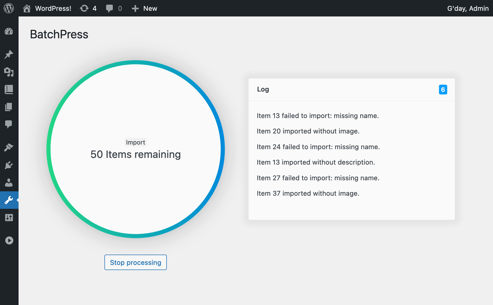

# BatchPress

BatchPress is a little starter plugin to help process data in batches. With BatchPress you can launch, monitoring and cancel multiple batched jobs.

`Note:` BatchPress doesn't actually process anything out of the box, this is meant purely as a starting point for creating quick plugins that need to run batched processes.

## Admin interface

